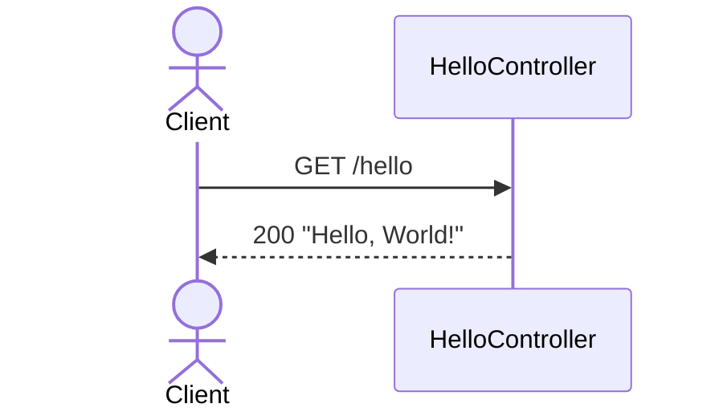
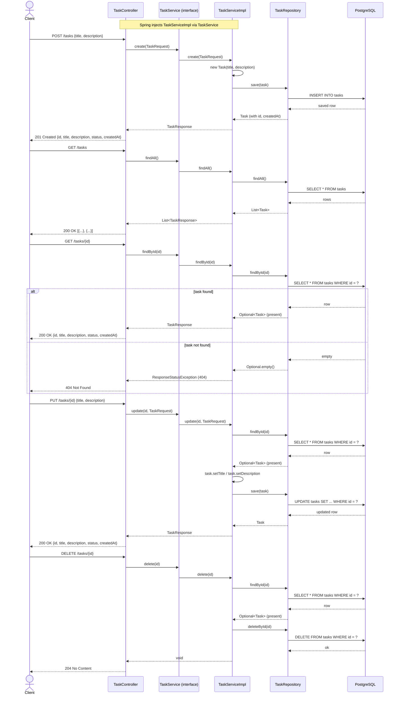

# Example App — Sequence Diagrams

## Hello World

```mermaid
sequenceDiagram
    actor Client
    participant HelloController

    Client->>HelloController: GET /hello
    HelloController-->>Client: 200 "Hello, World!"
```

## Task CRUD

```mermaid
sequenceDiagram
    actor Client
    participant TaskController
    participant TaskService as TaskService (interface)
    participant TaskServiceImpl
    participant TaskRepository
    participant PostgreSQL

    note over TaskController,TaskServiceImpl: Spring injects TaskServiceImpl via TaskService

    %% Create
    Client->>TaskController: POST /tasks {title, description}
    TaskController->>TaskService: create(TaskRequest)
    TaskService->>TaskServiceImpl: create(TaskRequest)
    TaskServiceImpl->>TaskServiceImpl: new Task(title, description)
    TaskServiceImpl->>TaskRepository: save(task)
    TaskRepository->>PostgreSQL: INSERT INTO tasks
    PostgreSQL-->>TaskRepository: saved row
    TaskRepository-->>TaskServiceImpl: Task (with id, createdAt)
    TaskServiceImpl-->>TaskController: TaskResponse
    TaskController-->>Client: 201 Created {id, title, description, status, createdAt}

    %% Find All
    Client->>TaskController: GET /tasks
    TaskController->>TaskService: findAll()
    TaskService->>TaskServiceImpl: findAll()
    TaskServiceImpl->>TaskRepository: findAll()
    TaskRepository->>PostgreSQL: SELECT * FROM tasks
    PostgreSQL-->>TaskRepository: rows
    TaskRepository-->>TaskServiceImpl: List<Task>
    TaskServiceImpl-->>TaskController: List<TaskResponse>
    TaskController-->>Client: 200 OK [{...}, {...}]

    %% Find By Id
    Client->>TaskController: GET /tasks/{id}
    TaskController->>TaskService: findById(id)
    TaskService->>TaskServiceImpl: findById(id)
    TaskServiceImpl->>TaskRepository: findById(id)
    TaskRepository->>PostgreSQL: SELECT * FROM tasks WHERE id = ?
    alt task found
        PostgreSQL-->>TaskRepository: row
        TaskRepository-->>TaskServiceImpl: Optional<Task> (present)
        TaskServiceImpl-->>TaskController: TaskResponse
        TaskController-->>Client: 200 OK {id, title, description, status, createdAt}
    else task not found
        PostgreSQL-->>TaskRepository: empty
        TaskRepository-->>TaskServiceImpl: Optional.empty()
        TaskServiceImpl-->>TaskController: ResponseStatusException (404)
        TaskController-->>Client: 404 Not Found
    end

    %% Update
    Client->>TaskController: PUT /tasks/{id} {title, description}
    TaskController->>TaskService: update(id, TaskRequest)
    TaskService->>TaskServiceImpl: update(id, TaskRequest)
    TaskServiceImpl->>TaskRepository: findById(id)
    TaskRepository->>PostgreSQL: SELECT * FROM tasks WHERE id = ?
    PostgreSQL-->>TaskRepository: row
    TaskRepository-->>TaskServiceImpl: Optional<Task> (present)
    TaskServiceImpl->>TaskServiceImpl: task.setTitle / task.setDescription
    TaskServiceImpl->>TaskRepository: save(task)
    TaskRepository->>PostgreSQL: UPDATE tasks SET ... WHERE id = ?
    PostgreSQL-->>TaskRepository: updated row
    TaskRepository-->>TaskServiceImpl: Task
    TaskServiceImpl-->>TaskController: TaskResponse
    TaskController-->>Client: 200 OK {id, title, description, status, createdAt}

    %% Delete
    Client->>TaskController: DELETE /tasks/{id}
    TaskController->>TaskService: delete(id)
    TaskService->>TaskServiceImpl: delete(id)
    TaskServiceImpl->>TaskRepository: findById(id)
    TaskRepository->>PostgreSQL: SELECT * FROM tasks WHERE id = ?
    PostgreSQL-->>TaskRepository: row
    TaskRepository-->>TaskServiceImpl: Optional<Task> (present)
    TaskServiceImpl->>TaskRepository: deleteById(id)
    TaskRepository->>PostgreSQL: DELETE FROM tasks WHERE id = ?
    PostgreSQL-->>TaskRepository: ok
    TaskServiceImpl-->>TaskController: void
    TaskController-->>Client: 204 No Content
```
