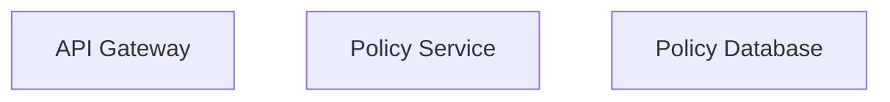

# Architecture Diagrams — {{dominio}}.{{servicio}}

<!--
  =============================================================================
  Architecture Diagrams as Code
  =============================================================================

  WHY THIS DIRECTORY EXISTS:
    Architecture diagrams live here as code (Mermaid or Structurizr DSL),
    not as images exported from draw.io. This ensures:
    1. Diagrams are version-controlled and diffable in PRs
    2. FTA fault trees can reference component names programmatically
    3. CI can validate that FTA components exist in these diagrams
    4. Diagrams stay current because they're reviewed with code changes

  C4 MODEL LEVELS:
    Place one file per diagram level:
    - context.md:   System context (L1) — your service and its external actors
    - containers.md: Container diagram (L2) — internal containers (API, DB, queue)
    - components.md: Component diagram (L3) — components within a container
    - sequences/:    Sequence diagrams for critical flows

  NAMING CONVENTION FOR COMPONENTS:
    Use PascalCase identifiers that match C4 conventions:
      ApiGateway, PolicyService, MessageBroker, PolicyDatabase
    These EXACT names must be used in /risk/fta/*.md files.
    The CI validator (build/validate-fta-diagrams.sh) enforces this.

  DIAGRAM FORMAT:
    Preferred: Mermaid (renders natively in GitHub)
    Alternative: Structurizr DSL (for complex C4 models)
  =============================================================================
-->

## Getting Started

1. Create your C4 context diagram in `context.md`
2. Add container and component diagrams as the service grows
3. Use consistent component names across all diagrams
4. Reference these components in `/risk/fta/` fault tree nodes

## Example Component Reference

When your diagram defines:



Then your FTA files MUST use these exact names:

```
BE-1: "Component: ApiGateway"
BE-2: "Component: PolicyService"
```
