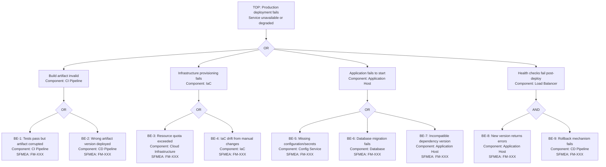

# FTA: Deployment Failure

<!--
  EXAMPLE FTA — Demonstrates the template with a deployment failure scenario.
  Replace this content with the actual analysis for your service.
-->

- **SFMEA Reference**: FM-XXX
- **Severity**: 7 (service unavailable or degraded during deploy)
- **Last Updated**: YYYY-MM-DD
- **Owner**: [team/person]

## Top Event

> A deployment to production fails, leaving the service in an unavailable or degraded state.

## Fault Tree Diagram

## Basic Events

| ID | Event | Component | Probability | Mitigation | Runbook |
|---|---|---|---|---|---|
| BE-1 | Artifact corrupted | CI Pipeline | L | Checksum verification | /runbooks/artifact-integrity.md |
| BE-2 | Wrong artifact version | CD Pipeline | M | GitOps, immutable tags | /runbooks/wrong-version.md |
| BE-3 | Resource quota exceeded | Cloud Infrastructure | L | Quota alerts, capacity planning | /runbooks/quota-exceeded.md |
| BE-4 | IaC drift | IaC | M | Drift detection, no manual changes | /runbooks/iac-drift.md |
| BE-5 | Missing config/secrets | Config Service | M | Pre-deploy validation | /runbooks/missing-config.md |
| BE-6 | DB migration failure | Database | M | Backward-compatible migrations | /runbooks/migration-failed.md |
| BE-7 | Incompatible dependency | Application Host | L | Lock files, CPM | /runbooks/dependency-conflict.md |
| BE-8 | New version returns errors | Application Host | M | Canary deployment, smoke tests | /runbooks/post-deploy-errors.md |
| BE-9 | Rollback fails | CD Pipeline | L | Rollback drills, blue-green | /runbooks/rollback-failed.md |

## Minimal Cut Sets

1. {BE-5} — Single point of failure: missing secrets prevents startup
2. {BE-6} — Single point of failure: failed migration blocks app boot
3. {BE-8, BE-9} — Combined: errors in new version + rollback fails = prolonged outage
4. {BE-4} — Single point of failure: IaC drift causes unexpected infra state

## Recommended Actions

| Action | Priority | Owner | Target Date | Status |
|---|---|---|---|---|
| Add pre-deploy config validation step | Critical | [owner] | YYYY-MM-DD | Open |
| Enforce backward-compatible DB migrations | High | [owner] | YYYY-MM-DD | Open |
| Monthly rollback drill in staging | High | [owner] | YYYY-MM-DD | Open |
| Add IaC drift detection to CI | Medium | [owner] | YYYY-MM-DD | Open |
