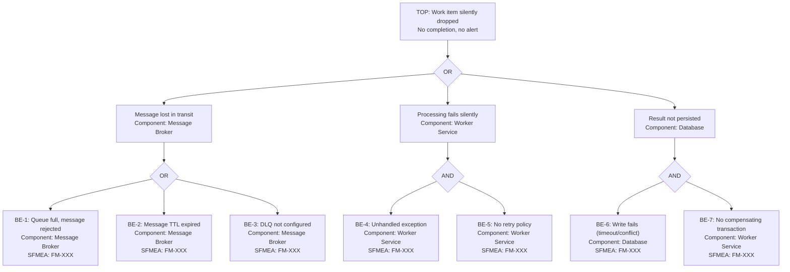

# FTA: Work Item Silently Dropped

<!--
  EXAMPLE FTA — Demonstrates the template with a common failure scenario.
  Replace this content with the actual analysis for your service.
-->

- **SFMEA Reference**: FM-XXX
- **Severity**: 8 (business transaction lost without trace)
- **Last Updated**: YYYY-MM-DD
- **Owner**: [team/person]

## Top Event

> A business transaction (e.g., policy creation, payment processing, claim filing) is accepted by the system but never completes, and no one is notified.

## Fault Tree Diagram

## Basic Events

| ID | Event | Component | Probability | Mitigation | Runbook |
|---|---|---|---|---|---|
| BE-1 | Queue full, message rejected | Message Broker | M | Autoscaling, backpressure | /runbooks/queue-full.md |
| BE-2 | Message TTL expired | Message Broker | L | TTL alerts, DLQ monitoring | /runbooks/message-ttl.md |
| BE-3 | DLQ not configured | Message Broker | L | IaC validation, deploy checks | /runbooks/dlq-missing.md |
| BE-4 | Unhandled exception in worker | Worker Service | M | Global exception handler | /runbooks/worker-crash.md |
| BE-5 | No retry policy configured | Worker Service | L | Code review, analyzer rule | - |
| BE-6 | Database write failure | Database | L | Connection pool monitoring | /runbooks/db-write-fail.md |
| BE-7 | No compensating transaction | Worker Service | M | Saga pattern, outbox pattern | - |

## Minimal Cut Sets

1. {BE-1} — Single point of failure: queue rejects message with no DLQ
2. {BE-3} — Single point of failure: DLQ not configured means lost messages can't be recovered
3. {BE-4, BE-5} — Combined: exception + no retry = silent drop
4. {BE-6, BE-7} — Combined: write fails + no compensation = inconsistent state

## Recommended Actions

| Action | Priority | Owner | Target Date | Status |
|---|---|---|---|---|
| Ensure DLQ on all queues via IaC | Critical | [owner] | YYYY-MM-DD | Open |
| Add Polly retry policies to all workers | High | [owner] | YYYY-MM-DD | Open |
| Add queue depth alert in Dynatrace | High | [owner] | YYYY-MM-DD | Open |
| Implement outbox pattern for critical writes | Medium | [owner] | YYYY-MM-DD | Open |
