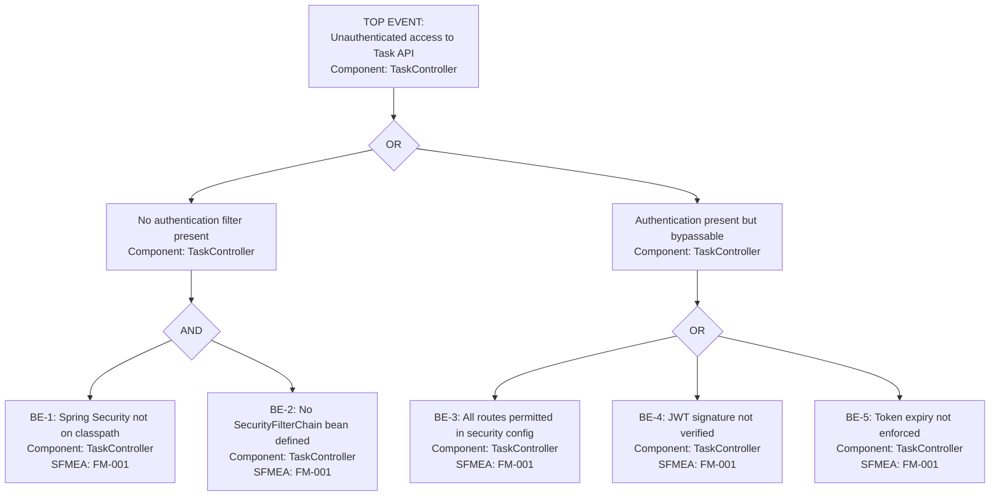

# FTA: Unauthenticated Access to Task API

- **SFMEA Reference**: FM-001
- **Severity**: 9 (data breach or full data destruction by anonymous caller)
- **Last Updated**: 2026-05-28
- **Owner**: team

## Top Event

> Any unauthenticated caller can invoke any Task API endpoint (create, read, update, delete) without presenting credentials, exposing all task data and enabling data destruction.

## Fault Tree Diagram

## Basic Events

| ID | Event | Component | Probability | Mitigation | Runbook |
|---|---|---|---|---|---|
| BE-1 | Spring Security not on classpath | TaskController | H | Add `spring-boot-starter-security` dependency | — |
| BE-2 | No SecurityFilterChain bean defined | TaskController | H | Define `SecurityFilterChain` in `config/SecurityConfig.java` | — |
| BE-3 | All routes permitted via `permitAll()` | TaskController | M | Restrict to authenticated routes; use `@PreAuthorize` | — |
| BE-4 | JWT signature not verified | TaskController | L | Use `spring-security-oauth2-resource-server`; enforce `jwk-set-uri` | — |
| BE-5 | Token expiry not enforced | TaskController | L | Validate `exp` claim; short-lived tokens (15 min) | — |

## Minimal Cut Sets

1. {BE-1, BE-2} — Spring Security absent: no filter chain exists, every request is admitted
2. {BE-3} — Single point of failure: security configured but all paths `permitAll()`
3. {BE-4} — Single point of failure: tokens accepted without signature check
4. {BE-5} — Single point of failure: expired tokens remain valid indefinitely

## Recommended Actions

| Action | Priority | Owner | Target Date | Status |
|---|---|---|---|---|
| Add `spring-boot-starter-security` dependency | Critical | team | 2026-06-04 | Open |
| Implement `SecurityFilterChain` in `config/SecurityConfig.java` requiring authentication on all `/tasks/**` routes | Critical | team | 2026-06-04 | Open |
| Add `@PreAuthorize` annotations per endpoint with role-based rules | High | team | 2026-06-11 | Open |
| Add security integration test asserting 401 on unauthenticated requests | High | team | 2026-06-11 | Open |
