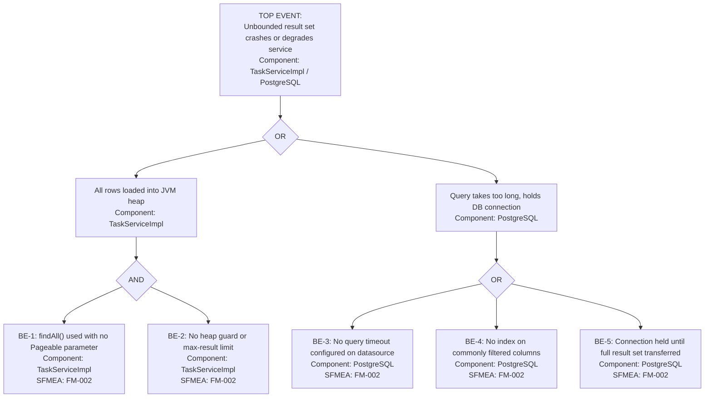

# FTA: Task List Returns Unbounded Result Set

- **SFMEA Reference**: FM-002
- **Severity**: 6 (OOM crash or extreme latency; service degradation for all users)
- **Last Updated**: 2026-05-28
- **Owner**: team

## Top Event

> `GET /tasks` loads every row from the tasks table into memory in a single query, causing heap exhaustion or extreme response latency as the table grows.

## Fault Tree Diagram

## Basic Events

| ID | Event | Component | Probability | Mitigation | Runbook |
|---|---|---|---|---|---|
| BE-1 | `findAll()` with no `Pageable` | TaskServiceImpl | H | Replace with `findAll(Pageable)`; expose `?page=&size=` query params | — |
| BE-2 | No max-result guard | TaskServiceImpl | H | Set default page size (e.g. 20); cap max page size (e.g. 100) | — |
| BE-3 | No query timeout on datasource | PostgreSQL | M | Set `spring.datasource.hikari.connection-timeout` and `query-timeout` | — |
| BE-4 | No index on `status` or `createdAt` | PostgreSQL | M | Add DB index on `status`, `created_at`; use `EXPLAIN ANALYZE` | — |
| BE-5 | Full result set transferred before response | PostgreSQL | H | Pagination eliminates full scan; streaming not needed with paging | — |

## Minimal Cut Sets

1. {BE-1, BE-2} — Core failure: unbounded `findAll()` with no server-side page limit
2. {BE-1, BE-3} — Slow full-table scan holds a Hikari connection until timeout
3. {BE-4} — Full-table sequential scan on large table even with pagination on unindexed column

## Recommended Actions

| Action | Priority | Owner | Target Date | Status |
|---|---|---|---|---|
| Replace `TaskRepository.findAll()` with `findAll(Pageable)` in `TaskServiceImpl` | Critical | team | 2026-06-04 | Open |
| Add `page` and `size` query parameters to `GET /tasks` in `TaskController` with defaults (size=20, max=100) | Critical | team | 2026-06-04 | Open |
| Set `spring.datasource.hikari.connection-timeout=30000` and `spring.jpa.properties.hibernate.query.timeout=10000` | Medium | team | 2026-06-11 | Open |
| Add DB index on `tasks(status)` and `tasks(created_at DESC)` | Medium | team | 2026-06-11 | Open |
