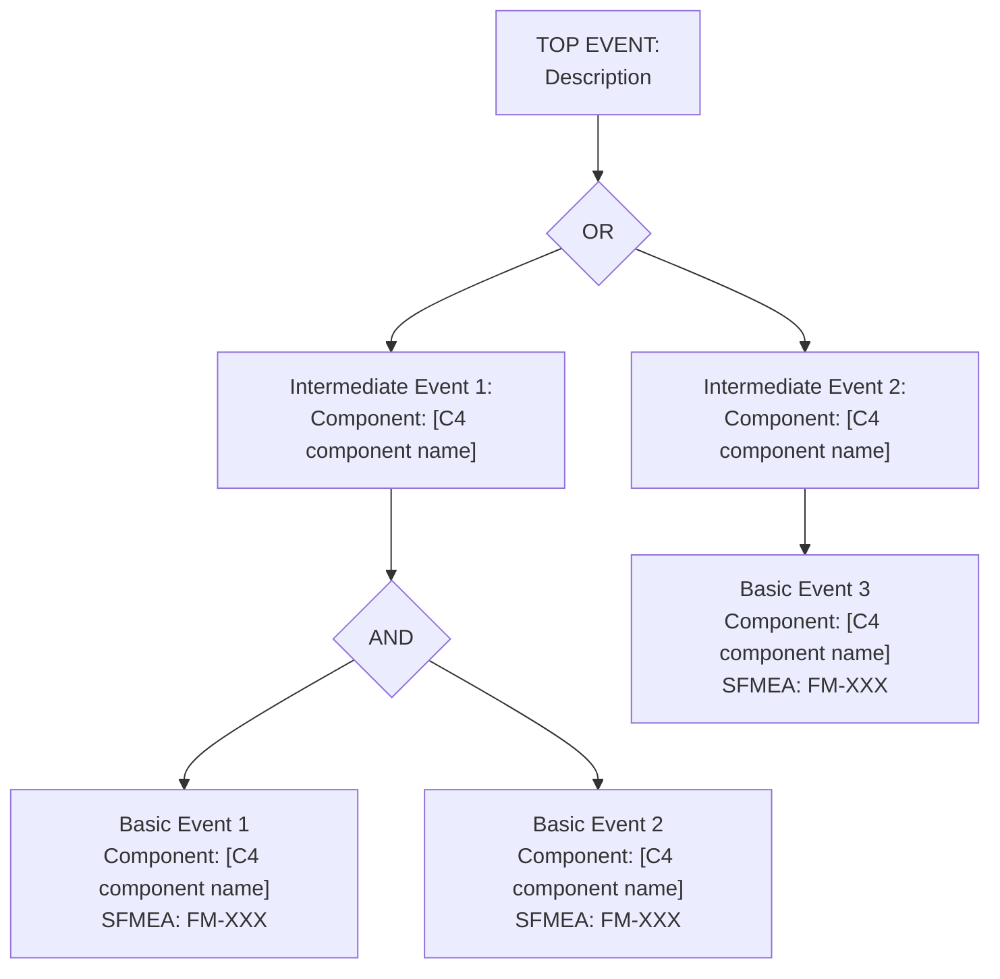

# FTA: [Top Event Name]

<!--
  =============================================================================
  Fault Tree Analysis (FTA) Template
  =============================================================================

  WHY THIS FILE EXISTS:
    FTA breaks down a top-level failure (the "top event") into its contributing
    causes using AND/OR logic gates. It answers: "What combination of failures
    leads to this catastrophic outcome?"

  HOW TO USE:
    1. Copy this template as /risk/fta/[top-event-name].md
    2. Define the top event (the failure you want to prevent)
    3. Decompose into intermediate events and basic events using AND/OR gates
    4. Each basic event should reference a component from /docs/architecture/
    5. Link back to SFMEA rows where applicable

  TRACEABILITY:
    - Every node in the tree MUST reference a component from C4 diagrams
      in /docs/architecture/. The CI validator (build/validate-fta-diagrams.sh)
      checks that component names in FTA files exist in architecture diagrams.
    - Basic events map to rows in risk/sfmea.md.
    - Mitigations map to runbooks in /runbooks/.

  DIAGRAM FORMAT:
    Use Mermaid flowchart syntax. This renders in GitHub, VS Code, and most
    Markdown viewers. For complex trees, PlantUML is also acceptable.
  =============================================================================
-->

- **SFMEA Reference**: FM-XXX
- **Severity**: [1-10]
- **Last Updated**: YYYY-MM-DD
- **Owner**: [team/person]

## Top Event

> [Describe the top-level failure in one sentence, e.g., "Customer cannot complete a policy purchase"]

## Fault Tree Diagram

## Basic Events

| ID | Event | Component | Probability | Mitigation | Runbook |
|---|---|---|---|---|---|
| BE-1 | [description] | [C4 component] | [H/M/L] | [control] | [/runbooks/xxx.md] |

## Minimal Cut Sets

<!--
  A minimal cut set is the smallest combination of basic events that
  causes the top event. Identify these to find the most critical
  single points of failure.
-->

1. {BE-X} — Single point of failure: [description]
2. {BE-Y, BE-Z} — Combined failure: [description]

## Recommended Actions

| Action | Priority | Owner | Target Date | Status |
|---|---|---|---|---|
| [action] | [Critical/High/Medium/Low] | [owner] | YYYY-MM-DD | [Open/In Progress/Done] |
