# HAZOP: Deployment Flow

<!--
  EXAMPLE HAZOP — Analyzes the deployment process for operational deviations.
  Replace this content with the actual analysis for your service's deploy flow.
-->

- **Process**: Production deployment pipeline (build -> test -> stage -> canary -> full rollout)
- **Scope**: From merge to main through production deployment
- **Last Updated**: YYYY-MM-DD
- **Participants**: [team members]

## Process Overview

```mermaid
flowchart LR
    N1["N1: Merge to main<br/>PR approved + squashed"] --> N2["N2: CI build + test<br/>Compile, analyze, test"]
    N2 --> N3["N3: Artifact publish<br/>Container image pushed"]
    N3 --> N4["N4: Stage deployment<br/>Deploy to staging env"]
    N4 --> N5["N5: Smoke tests<br/>Automated validation"]
    N5 --> N6["N6: Canary release<br/>5% production traffic"]
    N6 --> N7["N7: Full rollout<br/>100% production traffic"]
    N7 --> N8["N8: Post-deploy verify<br/>Health + metrics check"]
```

## HAZOP Analysis

| Node | Guide Word | Deviation | Cause | Consequence | Safeguard | Recommendation | SFMEA Ref |
|---|---|---|---|---|---|---|---|
| N1 | AS WELL AS | Two PRs merged simultaneously | No merge queue | Untested combination reaches CI | Branch protection rules | Enable GitHub merge queue | FM-XXX |
| N2 | PART OF | Tests pass but analysis skipped | Analyzer timeout | Vulnerable code ships | TreatWarningsAsErrors | Add analyzer timeout alert | FM-XXX |
| N2 | NO | Build fails silently | GitHub Actions runner OOM | No artifact, but no alert | Required status checks | Runner resource monitoring | FM-XXX |
| N3 | OTHER THAN | Wrong image tag pushed | Tag generation bug | Old code deployed as new | Immutable tags, SHA pinning | Tag verification step | FM-XXX |
| N4 | LATE | Staging deploy takes too long | Resource contention | Blocks release pipeline | Deployment timeout | Dedicated staging resources | FM-XXX |
| N5 | NO | Smoke tests not executed | Test infrastructure down | Unvalidated code proceeds | Required status check | Smoke test infra monitoring | FM-XXX |
| N5 | PART OF | Subset of smoke tests pass | Flaky tests disabled | Partial validation only | Test health dashboard | Flaky test SLO (< 1%) | FM-XXX |
| N6 | MORE | Canary gets more traffic than 5% | Load balancer misconfiguration | Impact larger than intended | Traffic percentage alerts | LB config validation | FM-XXX |
| N6 | REVERSE | Canary routes to old version | Routing rule error | Users see stale behavior | Version header validation | Request tracing verification | FM-XXX |
| N7 | EARLY | Full rollout before canary metrics | Impatient manual override | Issues hit 100% of users | Mandatory canary soak time | Automated promotion gate | FM-XXX |
| N7 | NO | Rollout stuck, not completing | K8s rolling update failure | Split-brain between versions | Rollout status monitoring | Rollout stuck alert | FM-XXX |
| N8 | LATE | Post-deploy metrics delayed | Observability pipeline lag | Problems detected too late | Real-time metrics (Dynatrace) | Metric freshness SLO | FM-XXX |
| N8 | NO | No post-deploy verification | Step skipped or broken | Silent degradation | Required step in pipeline | Pipeline integrity check | FM-XXX |

## Actions

| ID | Action | Priority | Owner | Target Date | Status |
|---|---|---|---|---|---|
| H-001 | Enable GitHub merge queue on main branch | High | [owner] | YYYY-MM-DD | Open |
| H-002 | Add analyzer timeout monitoring to CI | Medium | [owner] | YYYY-MM-DD | Open |
| H-003 | Implement automated canary promotion gate | High | [owner] | YYYY-MM-DD | Open |
| H-004 | Define flaky test SLO and dashboard | Medium | [owner] | YYYY-MM-DD | Open |
| H-005 | Add metric freshness SLO for post-deploy | Medium | [owner] | YYYY-MM-DD | Open |
