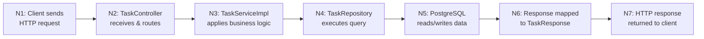

# HAZOP: Task CRUD Request Flow

- **Process**: HTTP request handling for Task CRUD operations (Client → Controller → Service → Repository → PostgreSQL)
- **Scope**: All five Task API operations: POST /tasks, GET /tasks, GET /tasks/{id}, PUT /tasks/{id}, DELETE /tasks/{id}
- **Last Updated**: 2026-05-28
- **Participants**: team

## Process Overview

## HAZOP Analysis

| Node | Guide Word | Deviation | Cause | Consequence | Safeguard | Recommendation | SFMEA Ref |
|---|---|---|---|---|---|---|---|
| N1 | NO | No authentication credential presented | Spring Security absent | All data accessible without identity | None | Add Spring Security filter chain | FM-001 |
| N1 | MORE | Request body larger than expected | No payload size limit | DoS via memory exhaustion parsing large JSON | None | Set `spring.mvc.servlet.max-request-size` | FM-002 |
| N1 | OTHER THAN | Malformed JSON body | Client bug or injection attempt | 400 or unhandled exception exposing internals | None | Add `@ControllerAdvice` for `HttpMessageNotReadableException` | FM-006 |
| N2 | NO | Required field `title` absent in `TaskRequest` | No Bean Validation | DB `NOT NULL` violation; 500 with SQL error message leaks to client | DB constraint | Add `@NotBlank` on `title`; `@Valid` on controller param | FM-005 |
| N2 | MORE | Same resource updated by two concurrent requests | No optimistic lock | Last writer silently overwrites; data loss with no error | None | Add `@Version` field to `Task`; catch `OptimisticLockException` | FM-003 |
| N2 | OTHER THAN | `{id}` path variable is not a valid Long | Client sends string | 400 from Spring type conversion; stack trace may leak | Spring default conversion error | Add `@ControllerAdvice` mapping `MethodArgumentTypeMismatchException` to 400 | FM-006 |
| N3 | NO | Task not found for `findById` / `update` / `delete` | Client sends non-existent id | `ResponseStatusException` 404 — correct, but message may expose internal format | `ResponseStatusException` | Ensure error message is sanitised; use RFC 7807 `ProblemDetail` | FM-006 |
| N3 | PART OF | `update()` reads task then saves without transaction | Concurrent modification between read and write | Stale data silently overwritten; no conflict error raised | None | Annotate `update()` with `@Transactional`; add `@Version` | FM-003 |
| N3 | REVERSE | `DELETE /tasks/{id}` permanently destroys data | No soft-delete logic | Deleted tasks unrecoverable; accidental or malicious deletion unaudited | None | Implement soft-delete with `deletedAt` column; add audit log | FM-004 |
| N4 | NO | `GET /tasks` issues `SELECT *` with no `LIMIT` | `findAll()` without `Pageable` | Full table loaded into heap; OOM or extreme latency | None | Introduce pagination via `Pageable`; cap max page size | FM-002 |
| N4 | MORE | Many slow queries hold connections simultaneously | No query timeout; no index | Hikari pool exhausted; all requests queue then timeout | Hikari default pool | Set query timeout; add indexes on `status`, `created_at` | FM-007 |
| N4 | LATE | Repository query slower than SLA | Table growth; missing index; lock contention | Client timeout; retry storms amplify load | None | Add query timeout; `EXPLAIN ANALYZE` on hot paths | FM-007 |
| N5 | NO | PostgreSQL unavailable | Host crash, network partition, maintenance | All operations fail with 500; total outage | Spring startup fail-fast | Add `/actuator/health` DB probe; configure connection retry | FM-008 |
| N5 | OTHER THAN | DB returns unexpected schema (column missing) | Hibernate `ddl-auto=update` divergence | `MappingException` at runtime; hard-coded schema assumption breaks | `ddl-auto=update` | Migrate to Flyway/Liquibase for schema management | FM-008 |
| N6 | MORE | `TaskResponse` includes sensitive internal fields | Record exposes all entity fields | Over-exposure of data; reveals internal IDs or timestamps unexpectedly | None | Audit `TaskResponse` fields; exclude fields not needed by clients | FM-001 |
| N7 | OTHER THAN | Error response exposes stack trace or SQL | No global exception handler | Internal architecture details visible to attacker | None | Add `@RestControllerAdvice` returning sanitised `ProblemDetail` | FM-006 |

## Actions

| ID | Action | Priority | Owner | Target Date | Status |
|---|---|---|---|---|---|
| H-001 | Add Spring Security with authentication requirement on all `/tasks/**` routes | Critical | team | 2026-06-04 | Open |
| H-002 | Add Bean Validation (`@NotBlank title`) and `@Valid` in `TaskController` | High | team | 2026-06-04 | Open |
| H-003 | Replace `findAll()` with paginated `findAll(Pageable)` | Critical | team | 2026-06-04 | Open |
| H-004 | Add `@Transactional` and `@Version` to `Task` entity for optimistic locking in `update()` | High | team | 2026-06-11 | Open |
| H-005 | Implement soft-delete (`deletedAt`) on `Task` entity; remove hard-delete | High | team | 2026-06-11 | Open |
| H-006 | Add `@RestControllerAdvice` returning RFC 7807 `ProblemDetail` for all error paths | High | team | 2026-06-11 | Open |
| H-007 | Configure Hikari pool size and query timeout in `application.properties` | Medium | team | 2026-06-18 | Open |
| H-008 | Replace `spring.jpa.hibernate.ddl-auto=update` with Flyway migrations | Medium | team | 2026-06-18 | Open |
| H-009 | Add `/actuator/health` with DB liveness probe | Medium | team | 2026-06-18 | Open |
