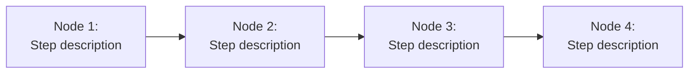

# HAZOP: [Process/Flow Name]

<!--
  =============================================================================
  HAZOP — Hazard and Operability Study Template
  =============================================================================

  WHY THIS FILE EXISTS:
    HAZOP analyzes operational processes (not code) by applying "guide words"
    to each step to find deviations. It answers: "What happens if this
    operational step goes wrong in an unexpected way?"

  WHEN TO USE HAZOP vs FTA:
    - FTA: "A specific failure happened. What caused it?" (backward analysis)
    - HAZOP: "We have this process. What COULD go wrong?" (forward analysis)

  GUIDE WORDS:
    | Guide Word | Meaning                    | Example                          |
    |------------|----------------------------|----------------------------------|
    | NO/NOT     | Complete absence            | No deployment artifact produced  |
    | MORE       | Quantitative increase       | More traffic than expected       |
    | LESS       | Quantitative decrease       | Less memory allocated            |
    | AS WELL AS | Additional unexpected event | Config change + migration at once|
    | PART OF    | Incomplete operation        | Partial rollback executed        |
    | REVERSE    | Opposite of intended        | Rollback deployed instead of new |
    | OTHER THAN | Different from intended     | Wrong environment targeted       |
    | EARLY      | Happens before expected     | Cache expires before TTL         |
    | LATE       | Happens after expected      | Health check response too slow   |

  HOW TO USE:
    1. Copy this template as /risk/hazop/[process-name].md
    2. Break the process into numbered nodes (steps)
    3. Apply each guide word to each node
    4. Record meaningful deviations, causes, consequences, and safeguards
    5. Link to SFMEA rows and runbooks where applicable
  =============================================================================
-->

- **Process**: [name of the operational flow]
- **Scope**: [what is included/excluded]
- **Last Updated**: YYYY-MM-DD
- **Participants**: [who performed the analysis]

## Process Overview

## HAZOP Analysis

| Node | Guide Word | Deviation | Cause | Consequence | Safeguard | Recommendation | SFMEA Ref |
|---|---|---|---|---|---|---|---|
| N1 | NO | [no X happens] | [why] | [impact] | [existing control] | [action] | FM-XXX |
| N1 | MORE | [excess X] | [why] | [impact] | [existing control] | [action] | FM-XXX |

## Actions

| ID | Action | Priority | Owner | Target Date | Status |
|---|---|---|---|---|---|
| H-001 | [action from analysis] | [priority] | [owner] | YYYY-MM-DD | Open |
